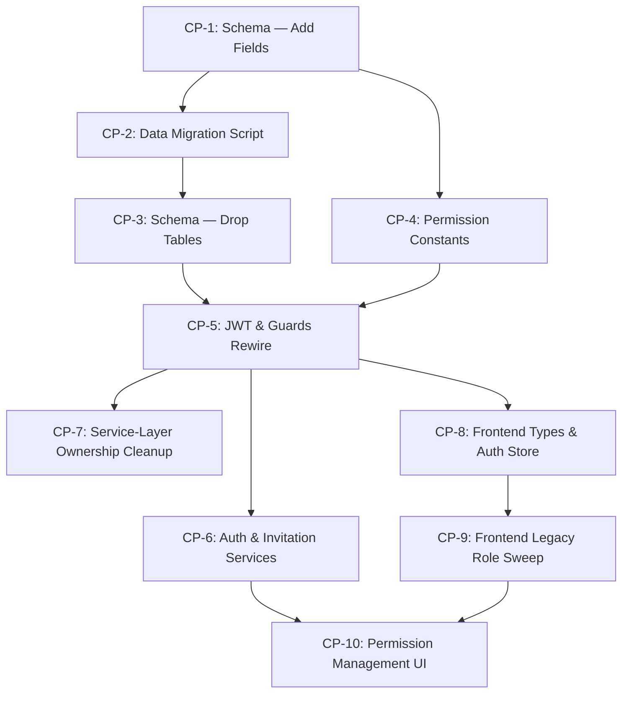

# RBAC Redesign —  Brolly-Style Implementation Plan

> **Goal:** Replace the current 18-role junction-table RBAC with a flat **6-tier role + per-user permissions** model, inspired by Brolly Africa.
>
> **Structure:** 10 checkpoints. Each is self-contained with handoff context. If credits run out, give this file to the next AI and tell it which checkpoint to start from.

---

## Architecture Decision

| Decision             | Answer                            | Rationale                                                                    |
| -------------------- | --------------------------------- | ---------------------------------------------------------------------------- |
| Junction tables      | **Kill**                    | Not in production yet. Clean slate is cheaper than legacy burden.            |
| Default permissions  | **Role defaults on invite** | Ghanaian brokerages are small — admins shouldn't tick 30+ boxes per invite. |
| Platform super admin | **6th hidden tier**         | Multi-tenant SaaS needs a god-mode actor above workspace owners.             |

---

## Target Model

```
┌─────────────────────────────┐
│  PLATFORM_SUPER_ADMIN (10)  │  ← Hidden. Platform-level only.
├─────────────────────────────┤
│  WORKSPACE_OWNER (8)        │  ← Brokerage firm owner. Billing, config.
├─────────────────────────────┤
│  ADMINISTRATOR (7)          │  ← Full system control within tenant.
├─────────────────────────────┤
│  MANAGER (5)                │  ← Approvals, reports, team oversight.
├─────────────────────────────┤
│  SUPERVISOR (4)             │  ← Branch/team monitoring, limited approvals.
├─────────────────────────────┤
│  AGENT (2)                  │  ← Daily operations, scoped by permissions.
└─────────────────────────────┘

Permissions do the heavy lifting:
  User: Kofi Mensah, Role: AGENT
  Permissions: ["policies.create", "policies.view", "claims.submit", "clients.manage"]

  User: Ama Owusu, Role: AGENT  
  Permissions: ["payments.manage", "premiums.reconcile", "reports.finance"]
```

---

## Dependency Graph



---

## Progress Tracker

| #  | Checkpoint                          | Status  | Completed By |
| -- | ----------------------------------- | ------- | ------------ |
| 1  | Schema — Add New Fields            | ✅ Done | 2026-04-04   |
| 2  | Data Migration Script               | ✅ Done | 2026-04-04   |
| 3  | Schema — Drop Junction Tables      | ✅ Done | 2026-04-04   |
| 4  | Permission Constants & Defaults     | ✅ Done | 2026-04-04   |
| 5  | JWT Strategy & Guards Rewire        | ✅ Done | 2026-04-04   |
| 6  | Auth & Invitation Service Updates   | ✅ Done | 2026-04-06   |
| 7  | Service-Layer Ownership Cleanup     | ✅ Done | 2026-04-07   |
| 8  | Frontend Types & Auth Store Rewrite | ✅ Done | 2026-04-07   |
| 9  | Frontend Legacy Role Sweep          | ✅ Done | 2026-04-07   |
| 10 | Permission Management UI            | ✅ Done | 2026-04-07   |

---

## CP-1: Schema — Add New Fields

### Goal

Add `SystemRole` enum, `role` field, and `permissions String[]` to the User model. **Do NOT drop junction tables yet.**

### Prerequisites

None — this is the starting checkpoint.

### Files to Change

| File                                  | Change                                         |
| ------------------------------------- | ---------------------------------------------- |
| `ibms-backend/prisma/schema.prisma` | Add `SystemRole` enum + 2 new fields on User |

### Exact Changes

**Add before the `model User` block:**

```prisma
enum SystemRole {
  PLATFORM_SUPER_ADMIN
  WORKSPACE_OWNER
  ADMINISTRATOR
  MANAGER
  SUPERVISOR
  AGENT
}
```

**Add to the `model User` block (after `email` field):**

```prisma
  role            SystemRole   @default(AGENT)
  permissions     String[]     @default([])
```

**Keep** `userRoleMappings UserRoleMapping[]` for now — CP-2 needs it.

### Run

```bash
cd ibms-backend
npx prisma migrate dev --name add-flat-role-permissions
```

### Done Criteria

- [ ] Migration runs without errors
- [ ] `npx prisma generate` succeeds
- [ ] User table now has `role` (enum) and `permissions` (text[]) columns
- [ ] Junction tables (`Role`, `Permission`, `RolePermission`, `UserRoleMapping`) still exist

### Handoff Context

> **For next AI:** CP-1 added `role SystemRole` and `permissions String[]` to the User model in schema.prisma. The old junction tables (`UserRoleMapping`, `Role`, `Permission`, `RolePermission`) still exist and are still referenced by the JWT strategy. Proceed to CP-2 to migrate existing data.

---

## CP-2: Data Migration Script

### Goal

Create and run a script that reads existing junction table data and populates the new flat `role` and `permissions` fields on every User.

### Prerequisites

- CP-1 completed (new fields exist on User)

### Files to Create

| File                                             | Action                  |
| ------------------------------------------------ | ----------------------- |
| `ibms-backend/scripts/migrate-to-flat-rbac.ts` | NEW — migration script |

### Script Logic

```typescript
// 1. For each User:
//    a. Query their UserRoleMapping → Role → name
//    b. Map highest role to canonical name using LEGACY_ROLE_ALIASES
//    c. Set user.role = canonical role
//    d. Query Role → RolePermission → Permission → action
//    e. Collect all permission action strings
//    f. Set user.permissions = [...permissionActions]
//
// 2. Edge cases:
//    - User with no UserRoleMapping → role = AGENT, permissions = []
//    - User with multiple roles → take highest level one
//
// 3. Log summary: X users migrated, Y skipped, Z errors

// Import the LEGACY_ROLE_ALIASES from:
// ibms-backend/src/common/constants/role-hierarchy.ts
```

### Run

```bash
cd ibms-backend
npx ts-node scripts/migrate-to-flat-rbac.ts
```

### Done Criteria

- [ ] Script runs without errors
- [ ] Every user in DB has a non-null `role` value (one of the 6 canonical roles)
- [ ] Users who had permissions via junction tables now have them in `permissions[]`
- [ ] Migration log shows 0 errors

### Handoff Context

> **For next AI:** CP-2 populated `role` and `permissions` on all existing users from the junction table data. The junction tables still exist but are now redundant. Proceed to CP-3 to drop them.

---

## CP-3: Schema — Drop Junction Tables

### Goal

Remove the 4 junction table models from schema and create the final migration.

### Prerequisites

- CP-2 completed (all users have flat role/permissions populated)

### Files to Change

| File                                  | Change                            |
| ------------------------------------- | --------------------------------- |
| `ibms-backend/prisma/schema.prisma` | Remove 4 models + their relations |

### Exact Changes

**Remove these models entirely:**

- `model Role { ... }`
- `model Permission { ... }`
- `model RolePermission { ... }`
- `model UserRoleMapping { ... }`

**Remove from `model User`:**

```prisma
  userRoleMappings        UserRoleMapping[]   // DELETE this line
```

**Remove from `model Tenant`:**

```prisma
  roles                  Role[]              // DELETE this line
```

### Run

```bash
cd ibms-backend
npx prisma migrate dev --name drop-rbac-junction-tables
```

### Done Criteria

- [ ] Migration runs without errors
- [ ] `npx prisma generate` succeeds
- [ ] Tables `roles`, `permissions`, `role_permissions`, `user_role_mappings` no longer exist in DB
- [ ] Schema has no reference to `UserRoleMapping`, `Role`, `Permission`, or `RolePermission`

### Handoff Context

> **For next AI:** CP-3 dropped all junction tables. The schema now has `role SystemRole` and `permissions String[]` directly on User. The old `userRoleMappings` relation no longer exists. **WARNING:** The JWT strategy (`jwt.strategy.ts`) still queries `userRoleMappings` — it will crash. CP-5 fixes this. Proceed to CP-4 first (no code breaks).

---

## CP-4: Permission Constants & Defaults

### Goal

Define the ~90 permission strings and the default permission sets for each role tier.

### Prerequisites

- None (can run in parallel with CP-1/2/3, no breaking changes)

### Files to Create

| File                                                         | Action                          |
| ------------------------------------------------------------ | ------------------------------- |
| `ibms-backend/src/common/constants/permissions.ts`         | NEW — all permission constants |
| `ibms-backend/src/common/constants/default-permissions.ts` | NEW — role default templates   |

### `permissions.ts` Content

```typescript
export const PERMISSIONS = {
  // Dashboard
  DASHBOARD_MARKETING: 'dashboard.marketing',
  DASHBOARD_GROWTH: 'dashboard.growth',
  DASHBOARD_REVENUE: 'dashboard.revenue',
  DASHBOARD_SALES_TRENDS: 'dashboard.sales_trends',
  DASHBOARD_LEAD_DISTRIBUTION: 'dashboard.lead_distribution',
  DASHBOARD_PRODUCT_DISTRIBUTION: 'dashboard.product_distribution',

  // Leads / CRM
  LEADS_VIEW: 'leads.view',
  LEADS_CREATE: 'leads.create',
  LEADS_EDIT: 'leads.edit',

  // Quotes
  QUOTES_VIEW: 'quotes.view',
  QUOTES_CREATE: 'quotes.create',
  QUOTES_SEND: 'quotes.send',
  QUOTES_ACCEPT: 'quotes.accept',
  QUOTES_DECLINE: 'quotes.decline',

  // Policies
  POLICIES_VIEW: 'policies.view',
  POLICIES_CREATE: 'policies.create',
  POLICIES_EDIT: 'policies.edit',
  POLICIES_CANCEL: 'policies.cancel',
  POLICIES_QA: 'policies.qa',
  POLICIES_APPROVE: 'policies.approve',
  POLICIES_ENDORSE: 'policies.endorse',

  // Claims
  CLAIMS_VIEW: 'claims.view',
  CLAIMS_SUBMIT: 'claims.submit',
  CLAIMS_INVESTIGATE: 'claims.investigate',
  CLAIMS_ASSESS: 'claims.assess',
  CLAIMS_APPROVE: 'claims.approve',
  CLAIMS_REJECT: 'claims.reject',

  // Clients
  CLIENTS_VIEW: 'clients.view',
  CLIENTS_CREATE: 'clients.create',
  CLIENTS_EDIT: 'clients.edit',
  CLIENTS_KYC: 'clients.kyc',

  // Renewals
  RENEWALS_VIEW: 'renewals.view',
  RENEWALS_PROCESS: 'renewals.process',
  RENEWALS_BULK: 'renewals.bulk',

  // Premium Financing
  PREMIUM_FINANCING_VIEW: 'premium_financing.view',
  PREMIUM_FINANCING_CREATE: 'premium_financing.create',
  PREMIUM_FINANCING_MANAGE: 'premium_financing.manage',

  // Payments
  PAYMENTS_VIEW: 'payments.view',
  PAYMENTS_COLLECT: 'payments.collect',
  PAYMENTS_RECONCILE: 'payments.reconcile',
  PAYMENTS_REMIT: 'payments.remit',

  // Commissions
  COMMISSIONS_VIEW: 'commissions.view',
  COMMISSIONS_MANAGE: 'commissions.manage',

  // Invoices
  INVOICES_VIEW: 'invoices.view',
  INVOICES_CREATE: 'invoices.create',
  INVOICES_SEND: 'invoices.send',
  INVOICES_CANCEL: 'invoices.cancel',

  // Reports
  REPORTS_VIEW: 'reports.view',
  REPORTS_FINANCE: 'reports.finance',
  REPORTS_NIC: 'reports.nic',
  REPORTS_EXPORT: 'reports.export',

  // Documents
  DOCUMENTS_VIEW: 'documents.view',
  DOCUMENTS_UPLOAD: 'documents.upload',
  DOCUMENTS_DELETE: 'documents.delete',

  // Complaints
  COMPLAINTS_VIEW: 'complaints.view',
  COMPLAINTS_CREATE: 'complaints.create',
  COMPLAINTS_RESOLVE: 'complaints.resolve',
  COMPLAINTS_ASSIGN: 'complaints.assign',
  COMPLAINTS_ESCALATE: 'complaints.escalate',

  // Tasks
  TASKS_VIEW: 'tasks.view',
  TASKS_CREATE: 'tasks.create',
  TASKS_ASSIGN: 'tasks.assign',

  // Users
  USERS_VIEW: 'users.view',
  USERS_INVITE: 'users.invite',
  USERS_MANAGE: 'users.manage',
  USERS_DEACTIVATE: 'users.deactivate',

  // Settings
  SETTINGS_VIEW: 'settings.view',
  SETTINGS_WORKSPACE: 'settings.workspace',
  SETTINGS_ROLES: 'settings.roles',
  SETTINGS_INTEGRATIONS: 'settings.integrations',

  // Approvals
  APPROVALS_VIEW: 'approvals.view',
  APPROVALS_PROCESS: 'approvals.process',

  // Imports
  IMPORTS_UPLOAD: 'imports.upload',
  IMPORTS_EXECUTE: 'imports.execute',

  // Chat
  CHAT_VIEW: 'chat.view',
  CHAT_SEND: 'chat.send',

  // Compliance
  COMPLIANCE_VIEW: 'compliance.view',
  COMPLIANCE_EDIT: 'compliance.edit',

  // Audit
  AUDIT_VIEW: 'audit.view',
} as const;

export type PermissionString = (typeof PERMISSIONS)[keyof typeof PERMISSIONS];
export const ALL_PERMISSIONS = Object.values(PERMISSIONS);
```

### `default-permissions.ts` Content

```typescript
import { PERMISSIONS as P } from './permissions';

export const DEFAULT_ROLE_PERMISSIONS: Record<string, string[]> = {
  PLATFORM_SUPER_ADMIN: Object.values(P),
  WORKSPACE_OWNER: Object.values(P),
  ADMINISTRATOR: Object.values(P),
  MANAGER: [
    P.DASHBOARD_REVENUE, P.DASHBOARD_SALES_TRENDS,
    P.POLICIES_VIEW, P.POLICIES_CREATE, P.POLICIES_EDIT,
    P.CLAIMS_VIEW, P.CLAIMS_SUBMIT, P.CLAIMS_ASSESS,
    P.CLIENTS_VIEW, P.CLIENTS_CREATE, P.CLIENTS_EDIT, P.CLIENTS_KYC,
    P.RENEWALS_VIEW, P.RENEWALS_PROCESS, P.RENEWALS_BULK,
    P.COMPLAINTS_VIEW, P.COMPLAINTS_CREATE, P.COMPLAINTS_RESOLVE, P.COMPLAINTS_ASSIGN,
    P.REPORTS_VIEW, P.REPORTS_FINANCE, P.REPORTS_EXPORT,
    P.USERS_VIEW, P.USERS_INVITE, P.USERS_MANAGE,
    P.APPROVALS_VIEW, P.APPROVALS_PROCESS,
    P.TASKS_VIEW, P.TASKS_CREATE, P.TASKS_ASSIGN,
    P.DOCUMENTS_VIEW, P.DOCUMENTS_UPLOAD,
    P.INVOICES_VIEW, P.INVOICES_CREATE, P.INVOICES_SEND,
    P.COMMISSIONS_VIEW,
    P.PAYMENTS_VIEW, P.PAYMENTS_COLLECT,
    P.CHAT_VIEW, P.CHAT_SEND,
    P.SETTINGS_VIEW,
    P.LEADS_VIEW, P.LEADS_CREATE, P.LEADS_EDIT,
    P.QUOTES_VIEW, P.QUOTES_CREATE, P.QUOTES_SEND,
  ],
  SUPERVISOR: [
    P.POLICIES_VIEW, P.POLICIES_CREATE, P.POLICIES_EDIT,
    P.CLAIMS_VIEW, P.CLAIMS_SUBMIT,
    P.CLIENTS_VIEW, P.CLIENTS_CREATE, P.CLIENTS_EDIT, P.CLIENTS_KYC,
    P.RENEWALS_VIEW, P.RENEWALS_PROCESS,
    P.COMPLAINTS_VIEW, P.COMPLAINTS_CREATE, P.COMPLAINTS_RESOLVE,
    P.REPORTS_VIEW,
    P.APPROVALS_VIEW,
    P.TASKS_VIEW, P.TASKS_CREATE,
    P.DOCUMENTS_VIEW, P.DOCUMENTS_UPLOAD,
    P.COMPLIANCE_VIEW,
    P.CHAT_VIEW, P.CHAT_SEND,
    P.LEADS_VIEW, P.LEADS_CREATE, P.LEADS_EDIT,
    P.QUOTES_VIEW, P.QUOTES_CREATE,
    P.INVOICES_VIEW,
    P.COMMISSIONS_VIEW,
  ],
  AGENT: [
    P.POLICIES_VIEW, P.POLICIES_CREATE,
    P.CLAIMS_VIEW, P.CLAIMS_SUBMIT,
    P.CLIENTS_VIEW, P.CLIENTS_CREATE,
    P.RENEWALS_VIEW,
    P.COMPLAINTS_VIEW, P.COMPLAINTS_CREATE,
    P.LEADS_VIEW, P.LEADS_CREATE, P.LEADS_EDIT,
    P.QUOTES_VIEW, P.QUOTES_CREATE,
    P.TASKS_VIEW,
    P.DOCUMENTS_VIEW,
    P.CHAT_VIEW, P.CHAT_SEND,
  ],
};
```

### Done Criteria

- [ ] Both files compile without errors
- [ ] `ALL_PERMISSIONS` contains ~90 entries
- [ ] Every role tier in `DEFAULT_ROLE_PERMISSIONS` follows least-privilege
- [ ] AGENT defaults are a subset of SUPERVISOR, which is a subset of MANAGER

### Handoff Context

> **For next AI:** CP-4 created permission constants (`permissions.ts`) and role-default templates (`default-permissions.ts`) in `ibms-backend/src/common/constants/`. These are imported by CP-5 (guards), CP-6 (auth service), and CP-8 (frontend). No code was broken — these are new files only.

---

## CP-5: JWT Strategy & Guards Rewire

### Goal

Make the backend read `user.role` and `user.permissions` directly instead of querying junction tables. Activate `PermissionsGuard`.

### Prerequisites

- CP-3 completed (junction tables dropped)
- CP-4 completed (permission constants exist)

### Files to Change

| File                                                    | Change                             |
| ------------------------------------------------------- | ---------------------------------- |
| `ibms-backend/src/auth/strategies/jwt.strategy.ts`    | Simplify to flat field reads       |
| `ibms-backend/src/common/guards/roles.guard.ts`       | Single role, single level lookup   |
| `ibms-backend/src/common/constants/role-hierarchy.ts` | Simplify to 6 entries only         |
| `ibms-backend/src/app.module.ts`                      | Register PermissionsGuard globally |

### Exact Changes

**jwt.strategy.ts — Replace `validate()` method:**

```typescript
// BEFORE: 3 nested JOINs via userRoleMappings
include: { userRoleMappings: { select: { role: { ... } } } }

// AFTER: direct flat field read
async validate(payload: JwtPayload) {
  const user = await this.prisma.user.findUnique({
    where: { id: payload.sub },
    select: {
      id: true, email: true, role: true, permissions: true,
      isActive: true, deletedAt: true, lockedUntil: true, tenantId: true,
    },
  });
  if (!user || user.deletedAt || !user.isActive) return null;
  if (user.lockedUntil && user.lockedUntil > new Date()) return null;
  return {
    sub: user.id,
    tenantId: user.tenantId,
    role: user.role,
    permissions: user.permissions,
    email: user.email,
  };
}
```

**roles.guard.ts — Simplify to single role:**

```typescript
canActivate(context: ExecutionContext): boolean {
  const requiredRoles = this.reflector.getAllAndOverride<string[]>('roles', [
    context.getHandler(), context.getClass(),
  ]);
  if (!requiredRoles || requiredRoles.length === 0) return true;

  const req = context.switchToHttp().getRequest<{ user?: { role?: string } }>();
  const user = req.user;
  if (!user?.role) return false;

  const userLevel = ROLE_LEVEL[user.role] ?? 0;
  return requiredRoles.some(r => userLevel >= (ROLE_LEVEL[r] ?? 0));
}
```

**role-hierarchy.ts — Simplify:**

```typescript
export const ROLE_LEVEL: Record<string, number> = {
  PLATFORM_SUPER_ADMIN: 10,
  WORKSPACE_OWNER: 8,
  ADMINISTRATOR: 7,
  MANAGER: 5,
  SUPERVISOR: 4,
  AGENT: 2,
};

export const CANONICAL_ROLES = [
  'PLATFORM_SUPER_ADMIN',
  'WORKSPACE_OWNER',
  'ADMINISTRATOR',
  'MANAGER',
  'SUPERVISOR',
  'AGENT',
] as const;

export type CanonicalRole = (typeof CANONICAL_ROLES)[number];
```

Remove: `LEGACY_ROLE_ALIASES`, `normalizeRoleName()`, `isCanonicalRole()`, `canAssignRole()`.

**app.module.ts — Register PermissionsGuard:**

```typescript
import { PermissionsGuard } from './common/guards/permissions.guard';
// Add to providers:
{ provide: APP_GUARD, useClass: PermissionsGuard },
```

### Done Criteria

- [ ] Backend compiles (`npm run build`)
- [ ] Login returns JWT with `{ role: "AGENT", permissions: ["policies.view", ...] }`
- [ ] `@Roles('SUPERVISOR')` blocks AGENT-level users
- [ ] `@RequirePermission('policies.create')` blocks users without that permission
- [ ] No references to `userRoleMappings` remain in backend code

### Handoff Context

> **For next AI:** CP-5 rewired the JWT strategy to read `user.role` and `user.permissions` directly (no joins). `RolesGuard` now does single-role level comparison. `PermissionsGuard` is globally registered. `role-hierarchy.ts` has only 6 entries. The backend now enforce dual-gate (role tier + permission string). **WARNING:** `auth.service.ts` and `invitations.service.ts` may still reference `userRoleMappings` when creating users — CP-6 fixes those.

---

## CP-6: Auth & Invitation Service Updates

### Goal

Update user creation flows (trial signup, login response, invitation acceptance) to use the flat `role` + `permissions` fields instead of junction table inserts.

### Prerequisites

- CP-5 completed (JWT reads flat fields)

### Files to Change

| File                                                     | Change                                     |
| -------------------------------------------------------- | ------------------------------------------ |
| `ibms-backend/src/auth/auth.service.ts`                | Use flat role/permissions on user creation |
| `ibms-backend/src/invitations/invitations.service.ts`  | Set defaults on invite acceptance          |
| `ibms-backend/src/users/users.controller.ts`           | New PATCH endpoints for role/permissions   |
| `ibms-backend/src/users/users.service.ts`              | New service methods                        |
| `ibms-backend/src/users/dto/update-permissions.dto.ts` | NEW — validation DTO                      |
| `ibms-backend/src/users/dto/change-role.dto.ts`        | NEW — validation DTO                      |

### Key Changes

**auth.service.ts — `startTrial()` / user creation:**

```typescript
// BEFORE: creates UserRoleMapping junction record
await this.prisma.userRoleMapping.create({ ... });

// AFTER: set flat fields directly
await this.prisma.user.create({
  data: {
    ...userData,
    role: 'WORKSPACE_OWNER',
    permissions: DEFAULT_ROLE_PERMISSIONS['WORKSPACE_OWNER'],
  }
});
```

**invitations.service.ts — invitation acceptance:**

```typescript
// AFTER
const user = await this.prisma.user.create({
  data: {
    ...userData,
    role: invitation.role as SystemRole,
    permissions: DEFAULT_ROLE_PERMISSIONS[invitation.role] ?? [],
  }
});
```

**users.controller.ts — New endpoints:**

```typescript
@Patch(':id/permissions')
@Roles('ADMINISTRATOR')
@RequirePermission('users.manage')
async updatePermissions(@Param('id') id: string, @Body() dto: UpdatePermissionsDto, @Req() req) { ... }

@Patch(':id/role')
@Roles('ADMINISTRATOR')
@RequirePermission('settings.roles')
async changeRole(@Param('id') id: string, @Body() dto: ChangeRoleDto, @Req() req) { ... }
```

### Done Criteria

- [ ] Trial signup creates user with `role: WORKSPACE_OWNER` + full permissions
- [ ] Invitation acceptance creates user with correct role + default permissions
- [ ] `PATCH /users/:id/permissions` works (admin can toggle permissions)
- [ ] `PATCH /users/:id/role` works (admin can change tier)
- [ ] No junction table inserts remain in auth/invitation flows

### Handoff Context

> **For next AI:** CP-6 updated all user creation flows to use flat `role` + `permissions` fields. New endpoints `PATCH /users/:id/permissions` and `PATCH /users/:id/role` are live. The backend is now fully functional on the new RBAC model. Proceed to CP-7 for service-layer cleanup or CP-8 for frontend.

---

## CP-7: Service-Layer Ownership Cleanup

### Goal

Update **all 28 backend files** that still query `userRoleMappings` or use `getActorMaxRoleLevel()` / `normalizeRoleName()`.

> [!WARNING]
> The original plan only listed 6 files. Actual grep found **28 files** referencing `userRoleMapping`. This is the largest checkpoint — split into 3 sub-batches.

### Prerequisites

- CP-5 completed (JWT returns flat `role` on request user)

### Group A — Core Domain Services (10 files)

| #  | File                                                       | Pattern Used                                     |
| -- | ---------------------------------------------------------- | ------------------------------------------------ |
| 1  | `complaints/complaints.service.ts`                       | `getActorMaxRoleLevel` + `userRoleMapping`   |
| 2  | `claims/claims.service.ts`                               | `getActorMaxRoleLevel` + `userRoleMapping`   |
| 3  | `quotes/quotes.service.ts`                               | `getActorMaxRoleLevel` + `normalizeRoleName` |
| 4  | `tasks/tasks.service.ts`                                 | `getActorMaxRoleLevel` + `userRoleMapping`   |
| 5  | `approvals/approvals.service.ts`                         | `getActorMaxRoleLevel` + `userRoleMapping`   |
| 6  | `finance/invoices/invoices.service.ts`                   | `getActorMaxRoleLevel` + `userRoleMapping`   |
| 7  | `finance/transactions/transactions.service.ts`           | `getActorMaxRoleLevel` + `userRoleMapping`   |
| 8  | `finance/commissions/commissions.service.ts`             | `getActorMaxRoleLevel` + `userRoleMapping`   |
| 9  | `finance/remittances/remittances.service.ts`             | `getActorMaxRoleLevel` + `userRoleMapping`   |
| 10 | `finance/premium-financing/premium-financing.service.ts` | `getActorMaxRoleLevel` + `userRoleMapping`   |

### Group B — Supporting Services (10 files)

| #  | File                               | Pattern Used                                   |
| -- | ---------------------------------- | ---------------------------------------------- |
| 11 | `policies/policies.service.ts`   | `userRoleMapping` + `normalizeRoleName`    |
| 12 | `clients/clients.service.ts`     | `userRoleMapping` + `normalizeRoleName`    |
| 13 | `leads/leads.service.ts`         | `userRoleMapping` + `normalizeRoleName`    |
| 14 | `renewals/renewals.service.ts`   | `getActorMaxRoleLevel`                       |
| 15 | `documents/documents.service.ts` | `userRoleMapping`                            |
| 16 | `imports/imports.service.ts`     | `userRoleMapping` + `normalizeRoleName`    |
| 17 | `imports/imports.controller.ts`  | `userRoleMapping`                            |
| 18 | `search/search.service.ts`       | `getActorMaxRoleLevel` + `userRoleMapping` |
| 19 | `settings/settings.service.ts`   | `getActorMaxRoleLevel` + `userRoleMapping` |
| 20 | `calendar/calendar.service.ts`   | `userRoleMapping`                            |

### Group C — Auth, Admin, Platform, Tests (8 files)

| #  | File                                                           | Pattern Used                                            |
| -- | -------------------------------------------------------------- | ------------------------------------------------------- |
| 21 | `users/users.service.ts`                                     | `userRoleMappings` in queries + `normalizeRoleName` |
| 22 | `users/admin.controller.ts`                                  | `userRoleMappings` in health check                    |
| 23 | `compliance/compliance-cron.service.ts`                      | `userRoleMappings` for admin lookup                   |
| 24 | `platform-admin/controllers/user-management.controller.ts`   | `userRoleMapping` in user details                     |
| 25 | `platform-admin/controllers/impersonation.controller.ts`     | `userRoleMappings` for role resolution                |
| 26 | `platform-admin/controllers/tenant-management.controller.ts` | `userRoleMapping`                                     |
| 27 | `main.ts`                                                    | `userRoleMappings` in bootstrap seeding               |
| 28 | `auth/auth.service.spec.ts`                                  | Test mocks referencing `userRoleMappings`             |

### Pattern to Replace

```typescript
// BEFORE (queries dropped junction table)
const mappings = await this.prisma.userRoleMapping.findMany({
  where: { userId },
  include: { role: true },
});
const maxLevel = Math.max(...mappings.map(m => ROLE_LEVEL[m.role.name] ?? 0));

// AFTER (flat — actor role already on request)
const userLevel = ROLE_LEVEL[actor.role] ?? 0;
```

Also replace `include: { userRoleMappings: ... }` in Prisma queries:

```typescript
// BEFORE
include: { userRoleMappings: { include: { role: true } } }

// AFTER (just select what you need)
select: { id: true, role: true, permissions: true, /* other fields */ }
```

### Suggested Execution Order

1. **Batch 7a:** Group A (#1-10) — core domain services
2. **Batch 7b:** Group B (#11-20) — supporting services
3. **Batch 7c:** Group C (#21-28) — auth, admin, platform, tests

### Done Criteria

- [ ] `grep -rn "userRoleMapping" ibms-backend/src/ --include="*.ts"` returns 0 results
- [ ] `grep -rn "getActorMaxRoleLevel" ibms-backend/src/ --include="*.ts"` returns 0 results
- [ ] `grep -rn "normalizeRoleName" ibms-backend/src/ --include="*.ts"` returns 0 results
- [ ] `npm run build` in `ibms-backend/` succeeds
- [ ] No Prisma errors about missing `userRoleMappings` relation

### Handoff Context

> **For next AI:** CP-7 cleaned **all 28 backend files** that referenced `userRoleMapping`, `getActorMaxRoleLevel`, or `normalizeRoleName`. The backend is fully migrated. Zero junction table references remain in `ibms-backend/src/`. Proceed to CP-8 for frontend.

---

## CP-8: Frontend Types & Auth Store Rewrite

### Goal

Rewrite the 3 core frontend RBAC files: types, auth store, and super admin hook. Create shared permission constants.

### Prerequisites

- CP-5 completed (backend returns flat `role` + `permissions` in JWT)

### Files to Change

| File                                           | Change                                                         |
| ---------------------------------------------- | -------------------------------------------------------------- |
| `src/types/index.ts`                         | Rewrite `UserRole` type (18 → 6), update `User` interface |
| `src/stores/auth-store.ts`                   | Delete ~155 lines, replace with ~30 lines                      |
| `src/hooks/super-admin/useSuperAdminAuth.ts` | Fix role check                                                 |
| `src/lib/permissions.ts`                     | NEW — shared permission constants for frontend                |

### Exact Changes

**`src/types/index.ts`:**

```typescript
// Replace lines 7-27
export type UserRole =
  | 'PLATFORM_SUPER_ADMIN'
  | 'WORKSPACE_OWNER'
  | 'ADMINISTRATOR'
  | 'MANAGER'
  | 'SUPERVISOR'
  | 'AGENT';

// Update User interface — add permissions, remove roles[]
```

**`src/stores/auth-store.ts`:**

DELETE:

- Lines 26-47: `ROLE_HIERARCHY` (18 entries)
- Lines 49-181: `PERMISSIONS` map (130 lines of hardcoded role→module→action)
- Lines 310-318: `hasRole()` with multi-role array logic
- Lines 321-338: `hasPermission()` with legacy fallback
- Line 367: `export { ROLE_HIERARCHY }` (if used elsewhere, update imports)

REPLACE WITH:

```typescript
const ROLE_HIERARCHY: Record<UserRole, number> = {
  PLATFORM_SUPER_ADMIN: 10,
  WORKSPACE_OWNER: 8,
  ADMINISTRATOR: 7,
  MANAGER: 5,
  SUPERVISOR: 4,
  AGENT: 2,
};

hasRole: (roles: UserRole[]) => {
  const user = get().user;
  if (!user) return false;
  const userLevel = ROLE_HIERARCHY[user.role] ?? 0;
  return roles.some(r => userLevel >= (ROLE_HIERARCHY[r] ?? 0));
},

// SIGNATURE CHANGE: (module, action) → (permission)
hasPermission: (permission: string) => {
  const user = get().user;
  if (!user) return false;
  return user.permissions?.includes(permission) ?? false;
},
```

**`src/hooks/super-admin/useSuperAdminAuth.ts`:**

```typescript
// Line 15: Replace
(user.role === 'PLATFORM_SUPER_ADMIN' || user.role === 'SUPER_ADMIN')
// With
(user.role === 'PLATFORM_SUPER_ADMIN' || user.role === 'WORKSPACE_OWNER')
```

**`src/lib/permissions.ts` (NEW):**
Mirror backend constants + add `PERMISSION_GROUPS` for the UI modal (CP-10 needs this).

### Done Criteria

- [ ] `npm run build` passes
- [ ] No TypeScript errors
- [ ] `hasPermission` signature is single-arg everywhere it's defined
- [ ] `ROLE_HIERARCHY` export has exactly 6 entries
- [ ] `useSuperAdminAuth` recognizes `WORKSPACE_OWNER`

### Handoff Context

> **For next AI:** CP-8 rewrote the 3 core frontend RBAC files. `UserRole` is now 6 values. `auth-store.ts` lost ~155 lines of legacy code. `hasPermission()` signature changed from `(module, action)` to `(permission)`. **WARNING:** Any file calling `hasPermission('module', 'action')` will have a TypeScript error — CP-9 fixes those. Also created `src/lib/permissions.ts` with shared constants.

---

## CP-9: Frontend Legacy Role Sweep

### Goal

Search-and-replace all remaining legacy role references and update `hasPermission()` call sites across 11 frontend files.

### Prerequisites

- CP-8 completed (core types/store rewritten)

### Files to Change

| #  | File                                                             | Change                                              |
| -- | ---------------------------------------------------------------- | --------------------------------------------------- |
| 1  | `src/components/layout/header.tsx`                             | Replace legacy role strings with canonical          |
| 2  | `src/components/features/settings/settings-users.tsx`          | Update role options to 6-tier list                  |
| 3  | `src/components/features/settings/settings-access-control.tsx` | Rewrite for 6 roles + permissions                   |
| 4  | `src/components/admin/invite-user-modal.tsx`                   | Verify dropdown uses 5 canonical roles              |
| 5  | `src/app/(auth)/login/page.tsx`                                | Replace `SUPER_ADMIN` → `PLATFORM_SUPER_ADMIN` |
| 6  | `src/app/dashboard/renewals/page.tsx`                          | Replace legacy role checks                          |
| 7  | `src/app/dashboard/policies/page.tsx`                          | Replace legacy role checks                          |
| 8  | `src/app/dashboard/finance/commissions/page.tsx`               | Replace legacy role checks                          |
| 9  | `src/app/dashboard/finance/expenses/page.tsx`                  | Replace legacy role checks                          |
| 10 | `src/app/(super-admin)/super-admin/tenants/new/page.tsx`       | Replace `SUPER_ADMIN` ref                         |
| 11 | `src/app/dashboard/admin/users/page.tsx`                       | Update role display                                 |

### Search Patterns

```bash
# Find all legacy role references:
grep -rn "SUPER_ADMIN\|TENANT_ADMIN\|BRANCH_MANAGER\|COMPLIANCE_OFFICER\|FINANCE_MANAGER\|SENIOR_BROKER\|BROKER\|UNDERWRITER\|SECRETARY\|DATA_ENTRY\|VIEWER" src/ --include="*.ts" --include="*.tsx"

# Find old hasPermission signature:
grep -rn "hasPermission(" src/ --include="*.ts" --include="*.tsx"
```

### Done Criteria

- [ ] `npm run build` passes with 0 errors
- [ ] `grep` for legacy role names returns 0 results in `src/`
- [ ] All `hasPermission` calls use single-string signature
- [ ] Login → dashboard works for all roles
- [ ] Role-gated nav items show/hide correctly

### Handoff Context

> **For next AI:** CP-9 cleaned all 11 frontend files of legacy role references. The frontend now uses only the 6 canonical roles and single-arg `hasPermission()`. The system is fully functional end-to-end on the new RBAC model. Proceed to CP-10 to build the permission management UI.

---

## CP-10: Permission Management UI

### Goal

Build the Brolly-style "Change Access Right" and "Set User Permissions" modals and wire them into the admin users page.

### Prerequisites

- CP-6 completed (backend endpoints exist)
- CP-9 completed (frontend fully on new model)

### Files to Create/Change

| File                                                             | Action                                               | Effort     |
| ---------------------------------------------------------------- | ---------------------------------------------------- | ---------- |
| `src/components/admin/change-role-modal.tsx`                   | **NEW** — role change modal                   | ~80 lines  |
| `src/components/admin/set-permissions-modal.tsx`               | **NEW** — permission checkbox modal           | ~250 lines |
| `src/components/admin/invite-user-modal.tsx`                   | **MODIFY** — add optional permission step     | ~30 lines  |
| `src/app/dashboard/admin/users/page.tsx`                       | **MODIFY** — add action buttons + wire modals | ~40 lines  |
| `src/components/features/settings/settings-access-control.tsx` | **MODIFY** — replace legacy matrix            | ~100 lines |
| `src/hooks/api/use-users.ts`                                   | **MODIFY** — add 2 new mutations              | ~30 lines  |

### "Change Access Right" Modal Spec

```
┌──────────────────────────────────────┐
│  Change Access Right                 │
│                                      │
│  User: Kofi Mensah                   │
│  Email: kofi@brokerage.com           │
│  Current Role: Agent                 │
│                                      │
│  ┌──────────────────────────────┐    │
│  │ Select Role          ▼      │    │
│  │  ○ Administrator             │    │
│  │  ○ Manager                   │    │
│  │  ○ Supervisor                │    │
│  │  ● Agent                     │    │
│  └──────────────────────────────┘    │
│                                      │
│  ☐ Reset permissions to defaults     │
│                                      │
│  [Cancel]              [Save Change] │
└──────────────────────────────────────┘
```

Rules: PLATFORM_SUPER_ADMIN hidden. Can't assign above your own role.

### "Set User Permissions" Modal Spec

```
┌──────────────────────────────────────────────────────────────┐
│  Set User Permissions                                        │
│                                                              │
│  User: Kofi Mensah  |  Role: Agent  |  kofi@brokerage.com   │
│                                                              │
│  ┌─ Search permissions... ──────────────────────────────┐    │
│                                                              │
│  ┌──────────────────────┬───────────────────────────────┐    │
│  │  Staff's Permissions │  Available Permissions        │    │
│  │  (Currently Assigned)│  (Toggle to assign)           │    │
│  │                      │                               │    │
│  │  • policies.view     │  ▼ Policies                   │    │
│  │  • policies.create   │    ☑ policies.view            │    │
│  │  • clients.view      │    ☑ policies.create          │    │
│  │                      │    ☐ policies.edit            │    │
│  │                      │    ☐ policies.cancel          │    │
│  │                      │                               │    │
│  │                      │  ▶ Claims (2 of 6 selected)   │    │
│  │                      │  ▶ Clients (2 of 4 selected)  │    │
│  │                      │  ...                          │    │
│  └──────────────────────┴───────────────────────────────┘    │
│                                                              │
│  [Reset to Defaults]       [Cancel]    [Save Permissions]    │
└──────────────────────────────────────────────────────────────┘
```

Features: Two-column, grouped accordion, search, select all/deselect all per group, reset to defaults button.

### API Hooks

```typescript
export function useUpdateUserPermissions() {
  return useMutation({
    mutationFn: ({ userId, permissions }) =>
      apiClient.patch(`/users/${userId}/permissions`, { permissions }),
  });
}

export function useChangeUserRole() {
  return useMutation({
    mutationFn: ({ userId, role, resetPermissions }) =>
      apiClient.patch(`/users/${userId}/role`, { role, resetPermissions }),
  });
}
```

### Done Criteria

- [ ] "Change Role" modal opens from user actions dropdown
- [ ] "Set Permissions" modal opens with current permissions pre-checked
- [ ] Toggling permissions updates in real-time (left panel reflects right panel)
- [ ] Save calls the backend and permissions take effect on next request
- [ ] Cannot assign role higher than your own
- [ ] "Reset to defaults" button works
- [ ] Search/filter in permissions modal works
- [ ] Invite modal assigns default permissions for selected role
- [ ] `npm run build` passes

### Handoff Context

> **For next AI:** CP-10 completed the Brolly-style RBAC UI. The system now has: 6-tier role hierarchy with flat permissions array on User, dual-gate backend enforcement (RolesGuard + PermissionsGuard), per-user permission checkbox modal, and role change modal. All junction tables are dropped, all legacy role references are removed. The RBAC redesign is **COMPLETE**.

---

## Final Cleanup Checklist (Post All Checkpoints)

After all 10 checkpoints are done, run this final verification:

- [ ] `grep -rn "userRoleMapping" ibms-backend/src/` → 0 results
- [ ] `grep -rn "SUPER_ADMIN\|TENANT_ADMIN\|BROKER\|VIEWER" src/` → 0 results (excluding comments)
- [ ] `cd ibms-backend && npm run build` → success
- [ ] `cd .. && npm run build` → success (frontend)
- [ ] Delete `ibms-backend/scripts/migrate-legacy-roles.ts` (Copilot's old script)
- [ ] Delete `ibms-backend/scripts/migrate-to-flat-rbac.ts` (CP-2 script, no longer needed)
- [ ] Delete `ibms-backend/prisma/seed-rbac.ts` (if exists — junction table seeder)

---

## Estimated Timeline

| Checkpoint      | Files               | Effort                       | Can Parallel With |
| --------------- | ------------------- | ---------------------------- | ----------------- |
| CP-1            | 1                   | 10 min                       | —                |
| CP-2            | 1 (new)             | 20 min                       | —                |
| CP-3            | 1                   | 10 min                       | —                |
| CP-4            | 2 (new)             | 15 min                       | CP-1, CP-2, CP-3  |
| CP-5            | 4                   | 30 min                       | —                |
| CP-6            | 6                   | 30 min                       | CP-7              |
| CP-7            | **28**        | **60 min** (3 batches) | CP-6              |
| CP-8            | 4                   | 25 min                       | —                |
| CP-9            | 11                  | 20 min                       | —                |
| CP-10           | 6                   | 45 min                       | —                |
| **Total** | **~64 files** | **~4.5 hrs**           |                   |
